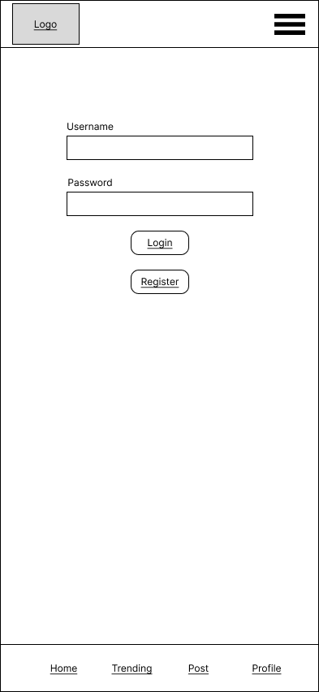
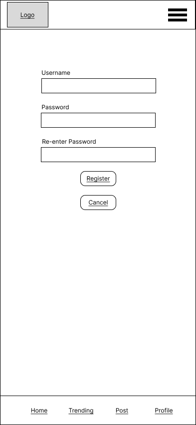
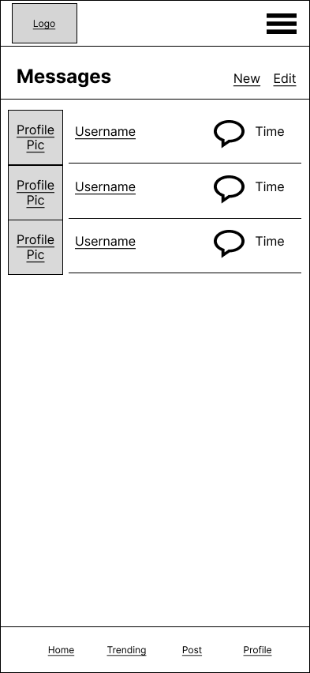
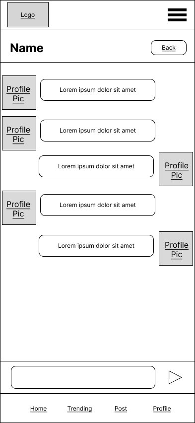
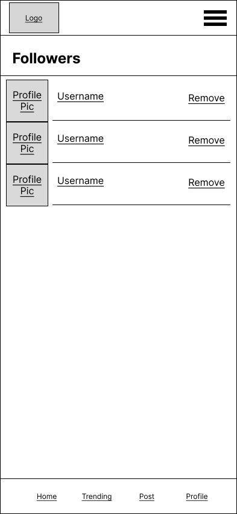
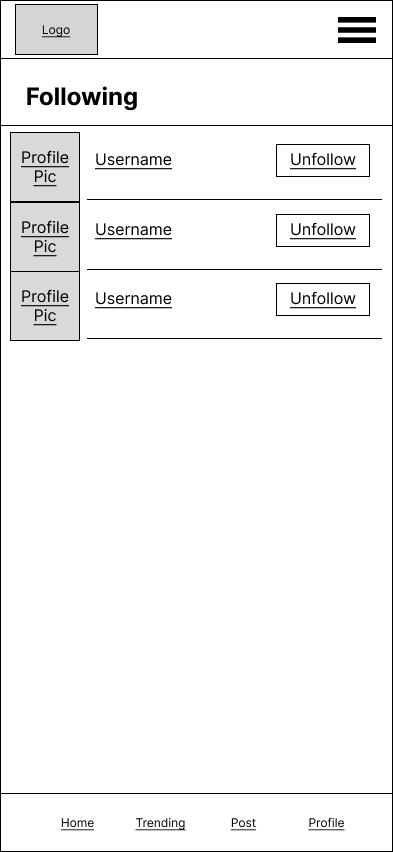
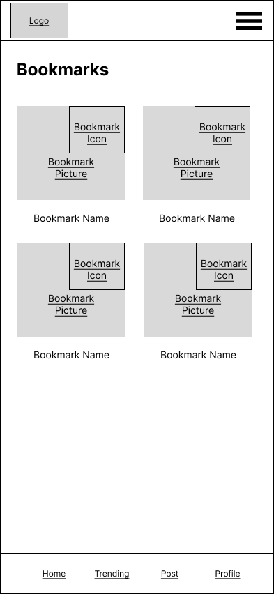

# User Experience Design

## Prototype:

- [Link to Figma Project And Prototype](https://www.figma.com/file/K1GxXaFQa89F1rCprwuhIf/Driply?node-id=0%3A1&t=cbvIjR1oTg4otRnz-1)

## App map:

## Wireframes:

- [Link to Figma Project](https://www.figma.com/file/K1GxXaFQa89F1rCprwuhIf/Driply?node-id=0%3A1&t=cbvIjR1oTg4otRnz-1)

### Login Screen
User will login in on this page or redirect to register for an account. Header includes a logo to go the trending page when not logged in. All footer tabs redirect to login as they are locked except for the trending tab.

### Register Screen
User can create an account on this page by supplying a username and matching passwords or cancel and redirect back to login.

### Trending Screen When Not Logged In
This page will show the trending posts with a search functionality that replaces the posts on the current page with the results. Profile picture and username will redirect to user profile who posted that post. Comment and like button will redirect to a page showing details of that specific post.

### Post Screen When Not Logged In
Displays details about a specific post with description, number of likes, and comments but user will not be able to like or comment. Poster's profile can be redirected to by clicking on the profile or username.

### Profile Screen When Not Logged In
Displays a user's profile information with basic informations about the user and a gallary of their posts that redirects on click. When not logged in, the profile tab on the footer will lead to login screen.

### Side Menu When Not Logged In
A side menu accessible from the hamburger menu that only contains a login redirect as other functions are locked until logged in.

### Home Screen When Logged In
Similar to trending screen except it shows the posts by people you follow without a search function. The side menu and footer are updated with unlocked functionalities now that the user is logged in. Logo will redirect to his page rather than the trending page when logged in.

### Trending Screen Screen When Logged In
Similar to homescreen as clicking on posts leads to page with all functionalities.

### Create Screen
Contains a form to create a post with a price slider and image input. Successful creation will lead to the post screen displaying information on the newly created post.

### Single Post Screen When Logged In
A screen displaying all information and functionalities of a post which is reached by clicking on a post when logged in. User can like and comment as well as view the profile of the user who posted it. Bookmark icon is unlocked to save a post.

### Contact Screen
Contact displays all followers who you can message with their profile being accessible.

### Chat Screen
Clicking on a contact on the contact screen will lead to a direct messaging chat system between the selected user and the logged in user.

### Profile Screen When Logged In
Similar to profile screen when not logged in except the logged in user's profile is now accessible. All functionalities are unlocked: followers and followings can be viewed and specific users can be followed.

### Followers Screen
Displays a list of all users that follows the logged in user with a redirect to their profile when their username or profile is clicked on.

### Following Screen
Displays a list of all users that the logged in user follows with a redirect to their profile when their username or profile is clicked on.

### Bookmarks Screen
Display a list of all posts that the user has bookmarked with a redirect that post's page and a unbookmark function.

### Settings Screen
Here, the logged in user can access their profile, log out, or change the light theme of their app.

### Side Menu Screen When Logged In
Side menu that allows logged in user to access all functions including bookmark, settings, messaging, trending, and profile.

